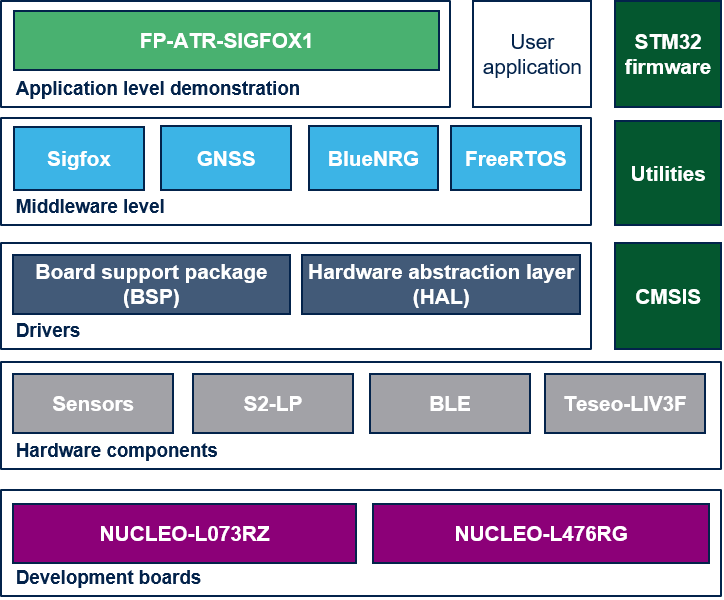

# FP-ATR-SIGFOX1 Firmware Package

FP-ATR-SIGFOX1 is a STM32Cube Function Pack that lets you read data from GNSS and environmental sensors and send this information via a Sigfox connectivity. Message sending is triggered by either user button pressing, by timer event or by threshold crossing events on environmental values or movement detection by the on-board accelerometer. Thresholds can be set using the ST Asset Tracking mobile app and transmitted to the firmware by Bluetooth Low Energy connectivity.

The package implements low power profiles and related transitions to ensure long battery autonomy.

This software together with the suggested combination of STM32 and ST devices is intended particularly to develop asset tracking applications. In addition to GNSS geolocation, Low-energy device geolocation is a service provided by the Sigfox infrastructure.

The software runs on the STM32 microcontroller and includes drivers for the S2-LP ultra-low power RF transceiver, the Bluetooth, the GNSS and the motion and environmental sensors

In this FW Package, the modules listed below are not directly accessible as they are subject to some restrictive license terms requiring user's approval via a "click thu" procedure. They have to be downloaded from the www.st.com website. The respective URL to download each one of these modules are available in a readme.txt file at the root of each folder.

- Middlewares/Third_Party/Sigfox/Sigfox_STM32_Library
- Middlewares/Third_Party/Sigfox/Sigfox

**FP-ATR-SIGFOX1 software features**:

- Complete firmware to connect an IoT node to a Sigfox network and sending environmental sensor data.
- Drivers for the S2-LP high performance ultra-low power RF transceiver, intended for RF wireless applications in the sub-1 GHz band.
- Wake-up, tilt and orientation detection by the on-board accelerometer. 
- Middleware library supporting Sigfox connectivity from package X-CUBE-SFXS2LP1 and Bluetooth connectivity from package X-CUBE-BLE1.
- GNSS location and low-energy device geolocation service provided by the Sigfox infrastructure.
- Easy portability across different MCU families, thanks to STM32Cube
- Free, user-friendly license terms

**Related information and documentation**:

- [UM2506](https://www.st.com/resource/en/user_manual/dm00558101.pdf): Getting started with the STM32Cube function pack for IoT tracker node with Sigfox connectivity, Bluetooth connectivity and sensors
- [UM2405](https://www.st.com/resource/en/user_manual/dm00498153.pdf): Getting started with the X-NUCLEO-S2868A1 SUb 1 GHz 868 MHz RF expansion board based on S2-LP radio for STM32 Nucleo
- [UM2638](https://www.st.com/resource/en/user_manual/dm00656126.pdf): Getting started with the X-NUCLEO-S2868A2 SUb 1 GHz 868 MHz RF expansion board based on S2-LP radio for STM32 Nucleo
- [UM2641](https://www.st.com/resource/en/user_manual/dm00660355.pdf): Getting started with the X-NUCLEO-S2915A1 Sub-1 GHz 915 MHz RF expansion board based on S2-LP radio for STM32 Nucleo 
- [UM2173](https://www.st.com/resource/en/user_manual/dm00365435.pdf): Getting started with the S2-LP Sigfox firmware, expansion for STM32Cube
- [UM2121](https://www.st.com/resource/en/user_manual/dm00333132.pdf): Getting started with the X-NUCLEO-IKS01A2 motion MEMS and environmental sensor expansion board for STM32
- [UM2559](https://www.st.com/resource/en/user_manual/dm00601501.pdf): Getting started with the X-NUCLEO-IKS01A3 motion MEMS and environmental sensor expansion board for STM32
- [UM1912](https://www.st.com/resource/en/user_manual/dm00210197.pdf): Getting started with X-NUCLEO-IDB05A1 BLE expansion board based on the SPBTLE-RF module for STM32 Nucleo
- [UM2700](https://www.st.com/resource/en/user_manual/dm00694112.pdf): Getting started with X-NUCLEO-IDB05A2 BLE expansion board based on the BlueNRG-M0 module for STM32 Nucleo 
- [UM2327](https://www.st.com/resource/en/user_manual/dm00453103.pdf): Getting started with the X-NUCLEO-GNSS1A1 expansion board based on Teseo-LIV3F tiny GNSS module for STM32 Nucleo
